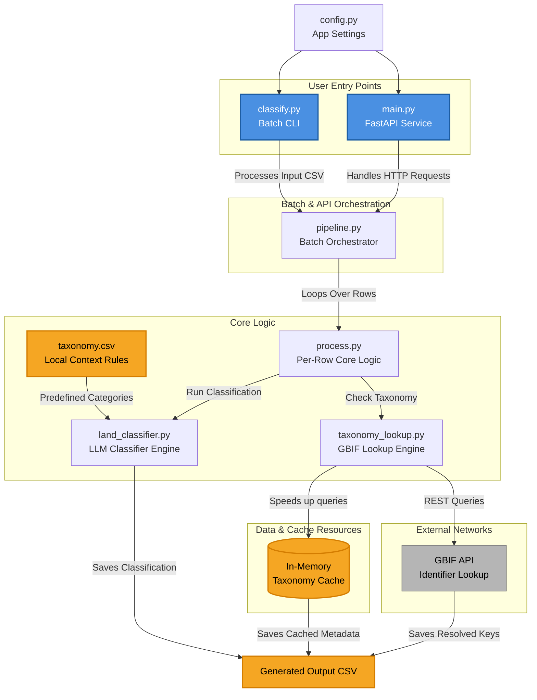

# Land Taxonomy & Plant Classifier (WP3)

A self-contained service that classifies herbarium specimen records from the BGBM dataset against CORINE Land Cover (CLC) habitat categories and resolves the specimen taxonomy against the GBIF backbone. Part of the broader BiodivPipeline project for FAIR biodiversity data processing.

## Overview

Given a CSV of herbarium records, the service derives a CLC habitat code from each record's locality / habitat-description text (via an LLM) and a GBIF backbone identifier from its scientific name. It produces a structured output CSV joining both back to the input record.

It is a **single service**. An earlier design split this into two containers (a land-taxonomy API and a classifier that called it over HTTP) but the land-classification logic has since been merged in (`land_classifier.py`). There is no longer a separate API to start or a network hop between them.

Two entry points share the same underlying code:

- **`main.py`**: FastAPI service for interactive use. `POST /classify` classifies a single free-text string; `POST /classify/csv` runs the full pipeline over an uploaded CSV and returns the processed file. Useful for exploring the classifier without preparing a dataset.
- **`classify.py`**: batch command-line entry point (`--input` / `--output`) that runs the full pipeline over a CSV. This is what the Nextflow integration uses.

## Project Structure

```
land-taxonomy-classifier/
├── app
│   ├── classify.py         # batch CLI entry point
│   ├── config.py
│   ├── land_classifier.py  # LLM land classifier (the merged API)
│   ├── main.py             # FastAPI interactive service
│   ├── models.py           # Pydantic models
│   ├── pipeline.py         # batch orchestration over the input CSV
│   ├── process.py          # per-row logic (land classification + GBIF)
│   ├── taxonomy.csv
│   └── taxonomy_lookup.py  # GBIF identifier lookup, with in-memory cache
├── changes.md
├── .env.example
├── docker-compose.yml
├── Dockerfile
├── README.md
└── requirements.txt
```

## Diagram


## Requirements

- Docker (and Docker Compose for the convenience setup)
- An OpenAI API key
  - Ollama can be used instead if there is no API key available (intended for testing the pipeline end to end).

## Setup

Copy the environment template and add your key:

```bash
cp .env.example .env
# edit .env:
# OPENAI_API_KEY=sk-your-key-here
```

## Running

### As a service (interactive)

```bash
docker compose --profile ollama up --build
```

Open the interactive docs at `http://localhost:8000/docs`.

- `POST /classify`: classify a single free-text locality/habitat string. Returns the matched CLC category. (land classification only)
- `POST /classify/csv`: upload a CSV and receive the processed CSV as a download. 

Input delimiter is auto-detected (comma/semicolon-separated inputs both accepted)

### As a batch job (CLI)

```**bash**
docker run --rm \
  -e OPENAI_API_KEY=$OPENAI_API_KEY \
  -v $(pwd)/input.csv:/in.csv \
  -v $(pwd):/out \
  taxonomy-classify:0.1 \
  python /app/classify.py --input /in.csv --output /out/output.csv
```

### Input Columns

| Column | Description |
|--------|-------------|
| `HerbariumID` | Unique record identifier |
| `Locality` | Free-text locality string |
| `FundortUNdOeko` | Habitat and ecology description (optional, preferred over `Locality` when present) |
| `FullNameCache` | Free-text scientific plant name |
| `Genus` | Free-text plant genus |
| `Family` | Free-text plant family |

## Output Format

Each row of the output CSV corresponds to one input record:

| Column | Description |
|--------|-------------|
| `id` | Record identifier, for joining with input data |
| `clc_code` | CORINE Land Cover Level-3 code (e.g. `311`) |
| `clc_name` | CLC category name (canonical, looked up from the code) |
| `clc_confidence` | LLM match confidence (`0.0`-`1.0`) |
| `clc_reason` | LLM explanation for the match |
| `clc_input` | The text that was classified |
| `clc_source` | Which model produced the classification (`openai` or `ollama`) |
| `clc_field` | Whether `FundortUNdOeko` or `Locality` was used as input |
| `taxon_identifier` | GBIF backbone key |
| `taxon_confidence` | GBIF match confidence (`0`-`100`) |
| `taxon_status` | `resolved`, `fuzzy`, `unresolved`, or `error` |
| `error` | Any error encountered while processing the row |

> **Confidence scales differ:** `clc_confidence` is `0.0`-`1.0` (LLM), `taxon_confidence` is `0`-`100` (GBIF). They are not comparable.

## Notes

- Classification quality depends heavily on input text. Records with only place names (e.g. "Bayern, SW Grainau") produce lower-confidence, less specific results than records with real habitat descriptions (e.g. "Weinbergshang").
- `FundortUNdOeko` is populated in approximately 26% of BGBM records; `Locality` covers 99.4%.
- The LLM is called once per record. At 100k records, OpenAI costs are non-trivial; use a smaller sample for development.
- GBIF results are cached in memory within a run, so repeated species names are looked up only once. The cache resets between runs.
- A `taxon_status` of `error` marks a transient GBIF failure (timeout, rate limit) rather than a genuine no-match — those rows can be safely re-run.
- `llama3.2` and `gpt-4o-mini` do not return the same results. The production model is intended to be an OpenAI model (e.g. `gpt-4o`), subject to evaluation. Ollama exists to run the service without an API key, not as a production target.
- Records are processed concurrently in batches (see `BATCH_SIZE` in `config.py`).

## Planned Extensions

- Cross-run persistence of the GBIF cache (e.g. SQLite) to avoid re-querying across separate runs
- Recording the GBIF match rank (species / genus / family) alongside the identifier

This service is also integrated into the BiodivPipeline Nextflow workflow as the `TAXONOMY_CLASSIFY` module; see that repository for pipeline-level usage.

## AI Assistance

This project was developed with the assistance of Claude for architectural guidance, code review, and documentation. All code has been reviewed and tested by the authors.
