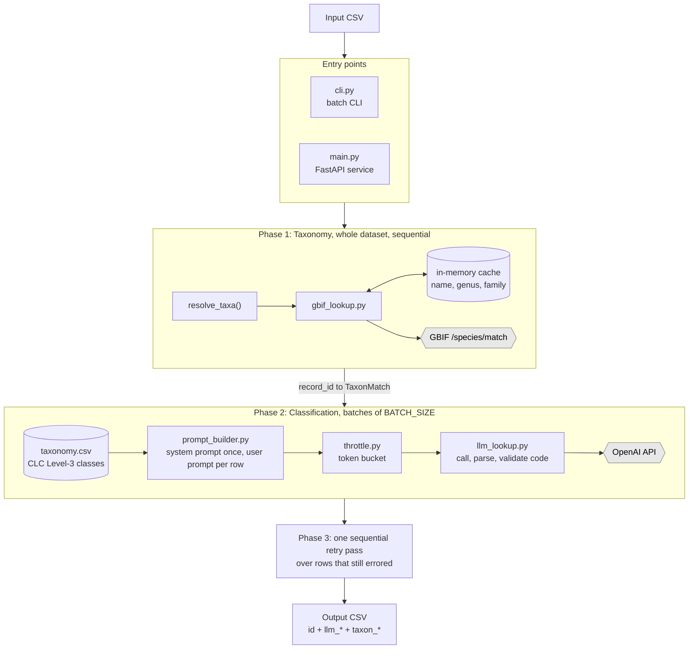

# Land Taxonomy Classifier (WP3)

Takes a CSV of herbarium specimen records and returns a CORINE Land Cover (CLC) code and a GBIF backbone identifier for each row. The GBIF backbone identifier is resolved from the plant name, family and genus. To obtain the CLC code, an LLM uses free-text locality description and plant data (refined through GBIF output) and analyzes those. \
Both are returned together and **joined** by record ID.

Part of the BiodivPipeline project, where it runs as the `TAXONOMY_CLASSIFY` Nextflow module. It also runs standalone as a FastAPI service or a batch CLI.

**Scope.** Land classification is inferred from text, not from coordinates.

---

## Quickstart

### Requirements
- Docker + Docker Compose
- An OpenAI API key

### Setup
```bash
cp .env.example .env
# edit .env and set OPENAI_API_KEY
```

The dataset schema (column mapping) ships with the image, so no further setup is needed for BGBM-format data. See [Using a different dataset](#using-a-different-dataset).

### Run the batch CLI (what the pipeline uses)
```bash
docker compose run --build --rm classifier \
  python -m app.cli --input /data/input10.csv --output /data/output.csv
```
`./data` is mounted at `/data`, so input and output paths are relative to it.
A 10-record sample ships at `data/input10.csv`.


### Run as an interactive service
```bash
docker compose up --build
```
Open `http://localhost:8000/docs`.

| Endpoint | Purpose |
|---|---|
| `POST /classify` | Upload a CSV, get back a processed CSV or JSON (`fmt=csv\|json`, `download_file=true\|false`) |
| `POST /price` | Upload a *processed* output file, get the OpenAI cost of that run |
| `GET /` | Health check |


### Run NF pipeline test
From the root folder:
```bash
nf-test test modules/local/taxonomy_classify/tests/main.nf.test
```

---

## Input

A CSV of herbarium records. Delimiter is auto-detected (comma or semicolon). Extra columns are ignored.

| Column | Role |
|---|---|
| `HerbariumID` | Record identifier. Falls back to the row index if absent. |
| `FullNameCache` | Scientific name (with authorship) sent to GBIF |
| `Genus`, `Family` | Sent to GBIF as matching context |
| `FundortUNdOeko` | Habitat/ecology text (preferred input for classification) |
| `Locality` | Free-text locality (used when `FundortUNdOeko` is empty or redundant) |
| `Anmerkungen` | Checked for cultivation markers (`cult.`, `kult`, `garten`, `garden`) so garden-grown specimens aren't classified by their natural habitat |
| `Latitude`, `Longitude` | Not used at runtime. |

### Using a different dataset
 
Column names are not hard-coded. They come from a schema file:
 
```json
{
  "columns": {
    "id": "HerbariumID",
    "name": "FullNameCache",
    "genus": "Genus",
    "family": "Family",
    "lat": "Latitude",
    "lon": "Longitude",
    "cultivated_field": "Anmerkungen"
  },
  "locality_labels": {
    "FundortUNdOeko": "Habitat and ecology",
    "Locality": "Locality"
  },
  "field_labels": {
    "species": "Species",
    "genus": "Genus",
    "family": "Family"
  }
}
```
 
- `columns` maps the roles the code needs to your dataset's headers.
- `locality_labels` is **priority-ordered**: the first field present is used, and later fields are added only if they are not redundant (see How It Works).
- `field_labels` and the values in `locality_labels` are the labels the **model** sees in the prompt — editing them changes the prompt, not just the parsing.
- If a plant is detected to be cultivated it is ignored.

The BGBM schema is loaded into the image as the default. To use another schema, change the default one and rebuild the docker image.
 
In the Nextflow pipeline the schema is staged as a process input and `DATASET_SCHEMA` is set to the staged path.
 
### Row handling
 
Every input row produces exactly one output row; nothing is filtered out.
 
- **No usable locality text**: a warning is logged, no LLM call is made, and the land-cover fields come back empty (`llm_code` empty, `llm_confidence` null).
- **No scientific name**: no GBIF call; taxonomy fields come back empty with `taxon_status: unresolved`.

---

## Output
 
One row per input record, joined on `id`. The pipeline has two phases. First, GBIF taxonomy is resolved for the whole dataset. Second, land classification runs in batches (means classifier can use the resolved taxon as context).
 
### Land cover (LLM)
 
| Column | Description |
|---|---|
| `id` | Record identifier from the input |
| `llm_code` | CORINE Level-3 code, e.g. `311` |
| `llm_name` | CLC category name for that code |
| `llm_confidence` | `0.0`–`1.0`, self-assigned by the model against a fixed rubric |
| `llm_reason` | The model's justification for the top match |
| `llm_input` | The exact text sent to the model, for auditing |
| `llm_all_matches` | Top-3 candidates: code, name, confidence, reason. JSON string in CSV output, nested array in JSON output. |
| `llm_top_n` | Number of candidates requested (3) |
| `llm_model` | Model that produced the classification |
| `llm_prompt_tokens`, `llm_completion_tokens`, `llm_cached_tokens` | Cost accounting |
| `llm_parse_failure` | Model output could not be parsed as JSON |
| `llm_unknown_code` | Model returned a code not in the CLC taxonomy |
| `llm_error` | Error text; empty on success |
 
### Taxonomy (GBIF)
 
| Column | Description |
|---|---|
| `taxon_key` | GBIF backbone key |
| `taxon_link` | Resolvable GBIF species URL |
| `taxon_confidence` | GBIF match confidence, `0`–`100` |
| `taxon_status` | `resolved` / `fuzzy` / `unresolved` / `error` (see below) |
| `taxon_canonical_name` | The name GBIF matched (may differ from the input name) |
| `taxon_rank` | `SPECIES`, `GENUS`, `SUBSPECIES`, … |
| `taxon_family` | Family from GBIF's classification — authoritative, may correct the input |
| `taxon_match_type` | `EXACT`, `FUZZY`, `HIGHERRANK`, `NONE` |
| `taxon_is_synonym`, `taxon_accepted_status` | Whether the matched name is a synonym |
| `error` | Row-level error; empty on success |
 
### `taxon_status`
 
- **`resolved`**: confidence ≥ `GBIF_CONFIDENCE_RESOLVED` (default 80) and match type is `EXACT` or `FUZZY`.
- **`fuzzy`**: a match was returned but did not meet that bar. This includes `HIGHERRANK` (even at confidence 100)
- **`unresolved`**: no name supplied, or GBIF returned no match / no confidence.
- **`error`**: a transient GBIF failure (timeout, rate limit, auth). Can be re-run.

### Reading the output correctly

- **Only a `resolved` taxon feeds the classifier as a clean name.** When status is `resolved`, the LLM receives GBIF's canonical name (rank-labelled, so a genus-only hit isn't presented as a species). For **any** other status — including `fuzzy` — the classifier falls back to the raw `FullNameCache` / `Genus` / `Family` from the input row. The GBIF *key* is never sent to the model. So an unresolved or fuzzy taxon still yields a land classification, just from unnormalised input.

- **Check `taxon_rank` before consuming `taxon_key`.** A `HIGHERRANK` match returns a valid key at *genus* level. The hybrid `Juncus effusus × Juncus inflexus` resolves to genus `Juncus` (key 2701072, rank `GENUS`) — a real key, but not a species. Consuming keys without checking rank silently mixes taxonomic levels.

- **The two confidences are unrelated.** `taxon_confidence` (0-100) is GBIF's `llm_confidence` (0.0-1.0) is the model scoring itself against a rubric that rewards specific habitat evidence in the text; it drives no logic and is not a calibrated probability. Do not threshold on it without validating it first.

- **High confidence ≠ correct.** The model reflects the text it was shown, not truth.

- **`taxon_is_synonym: true`** means the input name is outdated; `taxon_canonical_name` carries the currently accepted name.

---
## Parameters
 
All settings are environment variables, read at startup. Changing them does not require rebuilding the image.
 
| Variable | Default | Purpose |
|---|---|---|
| `OPENAI_API_KEY` | - | **Required.** |
| `OPENAI_MODEL` | `gpt-5.4-mini` | Classification model. Should appear in `MODEL_PARAMS` (`llm_lookup.py`); an unlisted model runs without its per-model options (temperature / reasoning effort). |
| `DEFAULT_MODEL` | = `OPENAI_MODEL` | Convenience alias. |
| `BATCH_SIZE` | `10` | Rows classified concurrently per batch. Chunking and failure isolation only (does not control throughput). |
| `GBIF_CONFIDENCE_RESOLVED` | `80` | Confidence (0-100) at or above which a GBIF match counts as `resolved`. Below it, the classifier falls back to the raw input name. |
| `OPENAI_TPM` | `200000` | Tokens/minute for the account's OpenAI tier. 200k is the base tier so raise it if your key has a higher limit (otherwise throughput needlessly slow). |
| `DATASET_SCHEMA` | baked-in schema | Absolute path to a dataset schema file. Set only when using a different dataset. |
| `TAXONOMY_PATH` | baked-in `taxonomy.csv` | Absolute path to the CLC class list. |
| `LOG_LEVEL` | `INFO` | Python log level. |
 
### CLI arguments
 
| Argument | Purpose |
|---|---|
| `--input` | Path to the input CSV |
| `--output` | Path for the output CSV |
 
---
## How It Works
 
### Flow



Taxonomy is resolved first for the whole dataset because the classifier uses the resolved name as prompt context. The phases are ordered by this dependency. White nodes are external services.
 
### Phase 1: Taxonomy (`gbif_lookup.py`)
 
One call per distinct `(name, genus, family)` triple to GBIF's `/v2/species/match`, with `kingdom=Plantae` and `strict=false`. Results are cached in memory on that triple, so repeated species cost one lookup each. The cache exists for the duration of a run and is then discarded. Transient failures (`status='error'`) are not cached.
 
The `resolved` / `fuzzy` decision happens here. Family is taken from GBIF's `classification` block rather than the input CSV, so mislabelling is fixed.
  
### Phase 2: Classification (`prompt_builder.py`, `llm_lookup.py`)

The system prompt is built once per run. It contains the CLC Level-3 class list (rendered from `taxonomy.csv` by `taxon_ref.py`), the classification instructions and a confidence rubric (explicit match (0.90-1.00) to no content (0.00)). This rubric is designed to stop the model defaulting to high scores on vague locality strings. The model has to respond with JSON only.
 
The user prompt is built per row as labelled lines:
 
```
Top N: 3
 
Habitat and ecology: <FundortUNdOeko>
Species: <name>
Family: <family>
```
 
- Locality fields are added in the priority order given by `locality_labels`, with a substring redundancy check.
- Taxon fields come from GBIF when `status == 'resolved'`, otherwise from the raw input columns. A genus-rank hit is labelled `Genus`, not `Species`, so the model
  does not infer a species' habitat from a name that isn't one.
- `has_content` is computed from whether any field had a value. 

The response is parsed as JSON; failure sets `llm_parse_failure`. The top match's code is extracted with a three-digit regex and looked up in the CLC table; a code outside the table sets `llm_unknown_code`. Both flags leave the row in the output rather than dropping it.

### Rate limiting (`throttle.py`)

Controls how frequently requests are sent to `OpenAI`. Depends on `OpenAI_TPM` set as environment variable.

---

 
## AI Assistance
 
This project was developed with the assistance of Claude for architectural guidance,
code review, and documentation. All code has been reviewed and tested by the authors.
 
