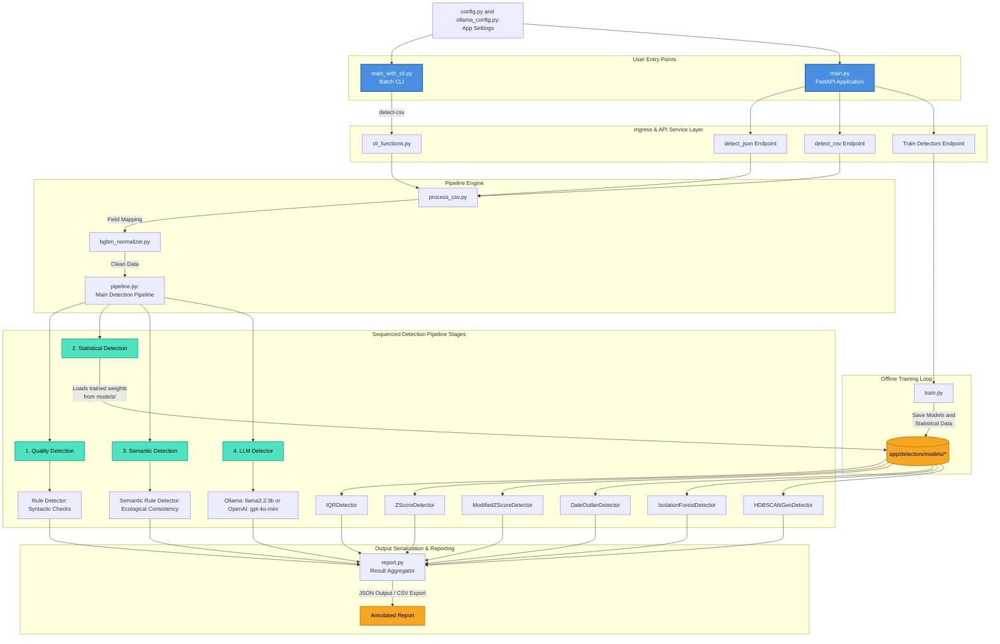

# Outlier and Data-Quality Detection Service (WP4)

A production-ready REST API for biodiversity data-quality validation, statistical outlier detection, and semantic consistency analysis.

Designed for herbarium and biodiversity datasets (e.g., BGBM specimen exports), the service combines rule-based validation, statistical anomaly detection, semantic rule checking, and optional LLM-based analysis into a modular detection pipeline.

---

## Overview

The detection pipeline processes biodiversity specimen records through multiple independent detector stages:

1. **Quality Detection** — rule-based validation for hard constraints
2. **Statistical Detection** — univariate and multivariate outlier analysis
3. **Semantic Detection** — ecological and textual inconsistency checking
4. **LLM Detection** (optional) — semantic analysis via Ollama

**See [Detectors.md](Detectors.md) for detailed descriptions of all 9 detector types, their algorithms, configuration options, and performance characteristics.**

---

## Project Structure

```
Taxonomy-Classifier-and-Outlier-Detection/
├── app/
│   ├── __init__.py
│   ├── cli_functions.py                 # CLI functions in
│   ├── config.py                        # Configuration constants
│   ├── main_with_cli.py                 # Main function for parsing CLI arguments
│   ├── main.py                          # FastAPI application
│   ├── ollama_config.py                 # Ollama service integration
│   ├── pipeline.py                      # Main detection pipeline
│   ├── report.py                        # Result aggregation and scoring
│   ├── schemas.py                       # Pydantic models (DetectionFlag, results)
│   ├── train.py                         # Offline detector training
│   ├── utils.py                         # Data normalization utilities
│   │
│   ├── detectors/                       # Detector implementations
│   │   ├── base.py                      # BaseDetector abstract class
│   │   ├── rule_detector.py             # RuleDetector (syntactic validation)
│   │   ├── semantic_rule_detector.py    # SemanticRuleDetector (ecological rules)
│   │   ├── iqr_detector.py              # IQRDetector (interquartile range)
│   │   ├── zscore_detector.py           # ZScoreDetector (z-score analysis)
│   │   ├── modified_zscore_detector.py  # ModifiedZScoreDetector (robust stats)
│   │   ├── date_outlier_detector.py     # DateOutlierDetector (year analysis)
│   │   ├── isolation_forest_detector.py # IsolationForestDetector (multivariate)
│   │   ├── hdbscan_geo_detector.py      # HDBSCANGeoDetector (density-based geo)
│   │   ├── llm_detector.py              # LLMDetector (semantic via LLM)
│   │   │
│   │   └── models/                      # Persisted detector models
│   │       ├── z-score.json
│   │       ├── modified-z-score.json
│   │       ├── iqr_detector.json
│   │       ├── date_outlier.json
│   │       ├── isolation_forest_scaler.pkl
│   │       ├── isolation_forest_model.pkl
│   │       ├── hdbscan_scaler.pkl
│   │       └── hdbscan_model.pkl
│   │
│   └── preprocessing/                   # Data preprocessing utilities
│       ├── bgbm_normalizer.py           # BGBM field normalization
│       └── process_csv.py               # Chunked CSV processing
│
├── tests/                               # Integration tests
│   └── test_service.py
│
├── Dockerfile
├── README.md
├── Detectors.md
├── docker-compose.yml
└── requirements.txt
```

## Canonical Field Names

The canonical BGBM header names used by the service are defined as constants in `app/config.py`. Use those constants when referring to CSV headers or integrating with the CSV ingestion pipeline. Key constants include:

- `HERBARIUM_ID` (`HerbariumID`)
- `FULL_NAME_CACHE` (`FullNameCache`)
- `COLLECTION_DATE_BEGIN` (`CollectionDateBegin`)
- `COLLECTION_DATE_END` (`CollectionDateEnd`)
- `COUNTRY` (`Country`)
- `LOCALITY` (`Locality`)
- `LATITUDE` (`Latitude`)
- `LONGITUDE` (`Longitude`)
- `BARCODE` (`Barcode`)
- `STABLE_URI` (`StableURI`)

Refer to [app/config.py](app/config.py) for the full list of header constants.

## Diagram


# Installation and Setup

## Prerequisites

- Python 3.13
- Docker and Docker Compose (optional)
- Ollama (for LLM detection)

---

## Docker Setup

### Build and Start

```bash
docker compose up --build
```

This starts:
- FastAPI service on `http://localhost:8000`
- Ollama service (if configured)

### Access Swagger UI

```
http://localhost:8000/docs
```

---

## Local Development Setup

### Create Virtual Environment

```bash
python -m venv .venv
```

### Activate Environment

**Linux/macOS:**
```bash
source .venv/bin/activate
```

**Windows:**
```powershell
.venv\Scripts\activate
```

### Install Dependencies

```bash
pip install -r requirements.txt
```

---

### LLM Mode With Ollama

Install Ollama locally:

```bash
ollama pull llama3.2:3b
ollama serve
```

The service automatically checks whether Ollama is reachable during startup.

---

## Start Service

```bash
uvicorn app.main:app --reload
```

The API is available at `http://127.0.0.1:8000/docs`

---

## CLI version 
The overall structure of the command line arguments:

```python
python -m app.main_with_cli [function] --file [filename] --output [output.csv] [other optional arguments]
```

Use the following command to view all available functions:
```python
python -m app.main_with_cli -h
```

To view optional arguments for each function, such as ```detect-csv```:
```python
python -m app.main_with_cli detect-csv -h
```

Example usage: run in the main directory the following command:

```python
python -m app.main_with_cli detect-csv --file input.csv --output output.csv
```

## Supported Input Formats

The API accepts:

- JSON payloads with record objects
- CSV file uploads (with automatic chunked processing)
- BGBM-compatible CSV formats (with or without headers)

---

## API Endpoints

### Health Check

```http
GET /health
```

Returns service status and Ollama connectivity.

**Response:**
```json
{
  "status": "ok",
  "ollama_running": true,
  "ollama_model": "llama3.2:3b"
}
```

---

### Detect From JSON

```http
POST /detect-json
```

Accepts biodiversity records directly as file upload. The JSON should be in the format below:

**Example JSON Request:**
```json
{
  "records": [
    {
      "id": "SPEC-001",
      "scientificName": "Quercus robur L.",
      "country": "Germany",
      "locality": "Berlin",
      "decimalLatitude": 52.52,
      "decimalLongitude": 13.405,
      "collectionDateBegin": "2020-06-15",
      "family": "Fagaceae",
      "genus": "Quercus"
    }
  ],
  "enable_quality": true,
  "enable_semantic": true,
  "enable_llm": false,
}
```

**Parameters:**
- `file` (required): JSON file upload
- `enable_llm` (default: false): Enable LLM-based semantic analysis
- `use_ollama` (default: false): Whether Ollama or OpenAI is used
- `download_csv` (default: false): Return results as CSV download
- `enable_semantic` (default: true): Enable semantic rule checking
- `enable_quality` (default: true): Enable rule-based quality checks (checks for missing columns)


**Response:**
```json
{
  "count": 1,
  "results": [
    {
      "id": "SPEC-001",
      "severity": "low",
      "score": 0.35,
      "flags": [
        {
          "field": "locality",
          "method": "semantic_rule_detector",
          "type": "suspicious_locality",
          "severity": "low",
          "score": 0.35,
          "message": "Locality contains unusual keywords.",
          "value": "Berlin"
        }
      ]
    }
  ],
  "annotated_records": [
    {
      "id": "SPEC-001",
      "scientificName": "Quercus robur L.",
      "outlier_detected": true,
      "outlier_status": "likely",
      "outlier_confidence": 35,
      "outlier_severity": "low",
      "outlier_score": 0.35,
      "outlier_primary_detector": "semantic_rule_detector",
      "outlier_primary_field": "locality",
      "outlier_reason": "Locality contains unusual keywords.",
      "outlier_summary": "Low outlier detected in locality by semantic_rule_detector."
    }
  ]
}
```

---

### Detect From CSV Upload

```http
POST /detect-csv
```

Accepts CSV file uploads and processes them in configurable chunks.

**Query Parameters:**
- `file` (required): CSV file upload
- `enable_llm` (default: false): Enable LLM analysis
- `use_ollama` (default: false): Whether Ollama or OpenAI is used
- `chunksize` (default: 1000): Records per chunk
- `max_records` (optional): Maximum total records to process
- `max_llm_records` (default: 25): Maximum records to send to LLM
- `llm_only_flagged` (default: true): Only analyze flagged records with LLM
- `download_csv` (default: false): Return results as CSV download
- `enable_semantic` (default: true): Enable semantic rule checking
- `enable_quality` (default: true): Enable rule-based quality checks (checks for missing columns)


**Example:**
```bash
curl -X POST "http://127.0.0.1:8000/detect-csv?enable_llm=true&download_csv=true" \
  -F "file=@herbarium_data.csv"
```

---

### Train Statistical Detectors From CSV

```http
POST /train-csv
```

Detectors that use statistics or models must be trained on your dataset before inference:

No training is required for rule-based detectors (RuleDetector, SemanticRuleDetector).

Accepts a CSV file upload and trains statistical detectors on the provided dataset. This endpoint persists learned model parameters and statistics for detectors that require training, such as IQR, z-score, modified z-score, Isolation Forest, and HDBSCAN.  Trained models persists to `app/detectors/models/`

**Form Fields:**
- `file` (required): CSV file upload
- `training_subset_size` (default: 500): Number of records sampled for detector training
- `training_seed` (default: 42): Seed used for reproducible sampling

**Example:**
```bash
curl -X POST "http://127.0.0.1:8000/train-csv" \
  -F "file=@training_data.csv" \
  -F "training_subset_size=1000" \
  -F "training_seed=42"
```

**Response:**
```json
{
  "message": "Training completed successfully.",
  "trained_records": 1234,
  "training_subset_size": 500,
  "training_seed": 42
}
```

---

# Configuration

## Environment Variables

```bash
OLLAMA_URL=http://localhost:11434       # Ollama service URL
OLLAMA_MODEL=llama3.2:3b                # Model name for LLM detection
```

## Detector Hyperparameters

See `app/pipeline.py` for configurable detector parameters:

- IQR multiplier (k)
- Z-score thresholds
- HDBSCAN cluster size
- Isolation Forest contamination
- Date year distance tolerances

---

# Data Format

The service expects records with optional BGBM-derived fields:

**Coordinate fields:**
- `decimalLatitude`, `decimalLongitude`

**Date fields:**
- `collectionDateBegin`, `collectionDateEnd`, `eventDate`, `eventYear`

**Taxonomy:**
- `scientificName`, `scientificNameFull`, `genus`, `family`

**Location:**
- `country`, `locality`, `habitat`, `fundortUndOeko`

**Identifiers:**
- `id`, `occurrenceID`, `catalogNumber`, `barcode`, `stableUri`

**Metadata:**
- `collector`, `collectorNumber`, `collectorNotes`, `labelText`, `expedition`

---

# Output Format

All endpoints return a `DetectResponse` with:

- **count**: Number of records processed
- **results**: List of `RecordQualityResult` objects
- **annotated_records** (optional): Original records with outlier annotations

Each `DetectionFlag` contains:

- `field`: Affected field name
- `method`: Detector method
- `type`: Flag type (e.g., "invalid_coordinate_range", "coordinate_iqr_outlier")
- `severity`: "info", "low", "medium", "high", or "critical"
- `score`: Confidence (0.0–1.0)
- `message`: Human-readable explanation
- `value`: Field value or additional context

---

# Development and Testing

Tests are located in `tests/test_service.py`:

```bash
pytest
```

Configure pytest with `pytest.ini`.

---

# Output Structure

Each processed record returns:

- `id`
- overall `severity`
- overall `score`
- list of `flags`

Each flag contains:

- affected `field`
- detector `method`
- detection `type`
- `severity`
- confidence `score`
- human-readable `message`
- original `value`

---

# Detector Pipeline

The pipeline currently supports:

## Quality Validation

- rule-based validation
- identifier checks
- date validation
- coordinate validation

---

## Statistical Outlier Detection

- IQR
- z-score
- modified z-score
- Isolation Forest
- DBSCAN

---

## Semantic Validation

- ecological plausibility
- geographic plausibility
- habitat consistency
- semantic LLM analysis
